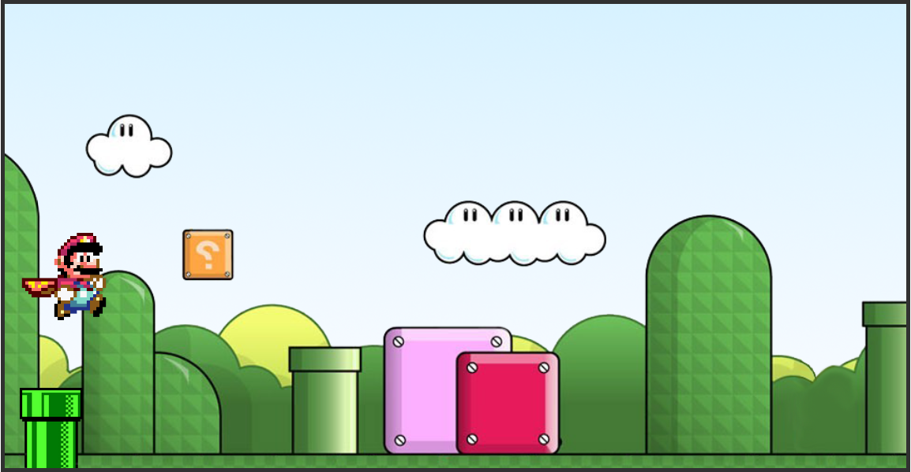

    <h1>mario-game</h1>

  

## Sobre

Desenvolvimento de um jogo simples do Mario, que se assemelha ao jogo 'T-Rex Running', do google chrome. O objetivo do jogo é desviar dos obstáculos.

## Tecnologias utilizadas

* HTML 
* CSS
* JavaScript

## Como jogar

1. Acesse o link: [mario-game-js-davirsreis.vercel.app](https://mario-game-js-davirsreis.vercel.app/)
2. Baixe o arquivo em ZIP, extraia e abra o arquivo .html com o seu navegador
